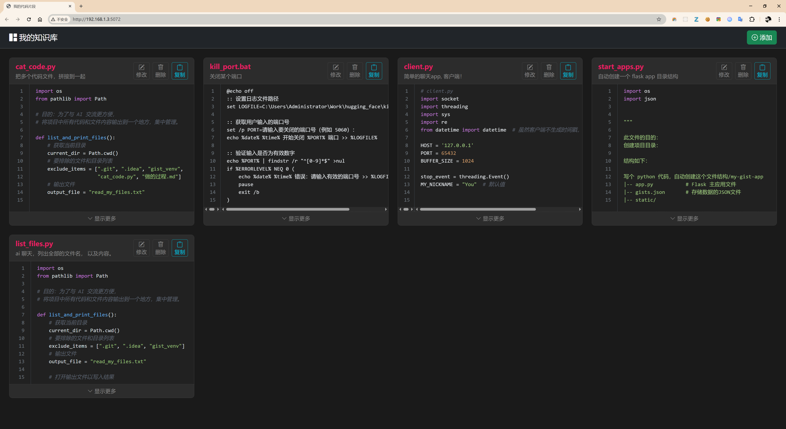
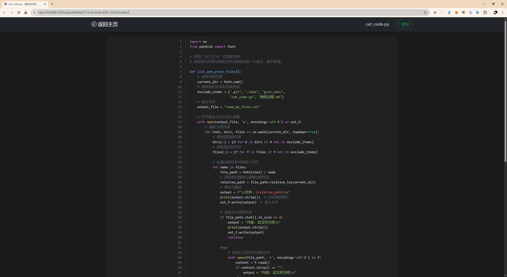

# My Knowledge Base (我的知识库)

一个基于 Flask 和原生 JavaScript 构建的、高度定制化的个人代码片段与知识管理工具。旨在提供一个快速、美观、专注且完全由自己掌控的云端“数字花园”。




---

## ✨ 项目特色 (Features)

-   **现代化网格布局:** 采用 CSS Grid 实现响应式多列卡片布局，信息密度高，视觉清爽。
-   **专注的代码详情页:** 每个知识片段都拥有独立的 URL，支持沉浸式、无干扰的代码阅读和分享。
-   **动态排序:** 列表根据条目的“最后更新时间”自动排序，确保最近使用的内容永远在最前面。
-   **代码高亮与折叠:** 支持多种语言的语法高亮，并为长代码提供自动折叠/展开功能，保持界面整洁。
-   **轻量级技术栈:** 仅使用 Flask 和原生 JavaScript，无过度依赖，启动快，易于维护和二次开发。
-   **纯本地化存储:** 所有数据保存在本地的 `gists.json` 文件中，无任何外部数据库依赖，隐私和数据安全尽在掌握。


---

## 🚀 快速开始 (Getting Started)

### 依赖环境

-   Python 3.8+
-   pip

### 安装与运行

1.  **克隆仓库**
    ```bash
    git clone https://github.com/buxuele/flask_gist_app
    cd flask_gist_app
    ```

2.  **创建并激活虚拟环境** (推荐)
    ```bash
    # Windows
    python -m venv venv
    .\venv\Scripts\activate

    # macOS / Linux
    python3 -m venv venv
    source venv/bin/activate
    ```

3.  **安装依赖**
    ```bash
    pip install -r requirements.txt
    ```

4.  **启动应用**
    ```bash
    python gist_app.py
    ```

    应用将在 `http://127.0.0.1:5072` 上运行。

---

## 🛠️ 技术栈 (Tech Stack)

-   **后端:** [Flask](https://flask.palletsprojects.com/)
-   **前端:**
    -   原生 JavaScript (ES6+)
    -   [Bootstrap 5](https://getbootstrap.com/) (用于基础组件和图标)
    -   [highlight.js](https://highlightjs.org/) (用于语法高亮)
-   **数据存储:** JSON 文件

---

## 📝 未来的计划 (Roadmap)

-   [ ] **详情页布局优化:** 实现全宽沉浸式代码视图，并增加明确的页面页脚。
-   [ ] **全文搜索功能:** 增加一个顶栏搜索框，快速查找片段。
-   [ ] **支持 Markdown:** 为每个片段增加一个支持 Markdown 语法的详细笔记区。
-   [ ] **标签系统 (Tagging):** 允许为每个片段添加标签，并支持按标签筛选。

---

## 🤝 贡献 (Contributing)

这是一个个人项目，但欢迎任何形式的交流和建议。如果你有任何想法，请随时提出 Issue。